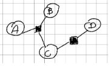

# Zadania

## 1. Zakładając poniższy korpus z dowma typami bytów nazwanych: osoba PER i lokalizacja LOC ( używamy 5 znaczników B-LOC, I-LOC, B-PER, I-PER, )

- Harvey Ford - występujący 9 razy jako PER i raz jako LOC
- Harvey Park - występujący 9 razy jako LOC i raz jako PER
- Myrtle Ford - występujący 9 razy jako PER i raz jako LOC
- Myrtle Park - występujący 9 razy jako LOC i raz jako PER

Oblicz prawdopodobieństwo otagowania "Harvey Ford" jako osobę przez model MEMM, zakładając, że użyty klasyfikator bazowany idealnie zamodelował pradowopodobieństwa warunkowe.

## 2. Dla podanego grafu rozkładu na czynniki podaj postać modelu rozkładu prawdopodobieństwa. Skonstruuj odpowiadający mu nieskierowany graf Markowa i zapisz inny rozkład na czynniki, który byłby z nim kompatybilny

A - B
B - C
A - C
C - D

Wzór: $P(A,B,C,D) = \frac{1}{2}\psi_1(A,B,C)\psi_2(C,D)$

Stała normalizująca Z przez obliczenie: $\sum_A\sum_B\sum_C\sum_D\psi_1(A,B,C)\psi_2(C,D)=1$

Kompatybilny zapis graficzny:

- $P(A,B,C,D) = \frac{1}{2} \psi_1(D,C)\psi_2(A,B)\psi_3(A,C)\psi_4(B,C)\psi_5(B)$

## 3. Rozpisz wzór na model liniowy CRF obliczający prawdopodobieństwo sekwencji tagów 'N V N' dla zdania 'Ala ma kota'

$P(N,V,N|Ala,ma,kota) = \frac{1}{Z}\prod\limits_i \psi_i(y_i,y_{i-1},x_i) = \frac{1}{Z}\psi_1(N,[Start],Ala)\psi_2(V,N,ma)\psi_3(N,V,kota)$
$\psi(a,b,c)=e^{W^T\sigma(a,b,c)}$
$Z=\prod_{Y_1}\prod_{Y_2}\prod_{Y_3}\psi_1\psi_2\psi_3$

## 4. Zapisz wzór na algorytm Viterbiego dla modelu CRF

## 5. Czy do implementacji warstwy CRF w sieci neuronowej należy wykorzystać algorytm propagacji zaufania (w przód i w tył) czy można wykorzystać standardowy autograd? Czy implementując sieć neuronową należy  zaimplementować zarówno wektory w przód jak i w tył?

## 6. Na wykładzie zaprezentowano warstwy CRF z funkcjami kompatybilnoSci inspirowanymi modelem HMM. Narysuj graf rozkładu na czynniki takiego modelu. Zaproponuj własne rozszerzenie (inne od tych podawanych na wykładzie) warstwy CRF o wykorzystywanie dodatkowych informacji. Określ jakie zalety i wady ma proponowany model względem warstwy CRF prezentowanej na wykładzie

## 7. Oblicz sekwencj€ wyniköw zwracanych przez rekurencyjnq Siec neuronowq dla zdania „Ala ma kota". Siec ma dwa neurony rekurencyjne, ktöre maja zerowy wyraz wolne i toisamoSciowQ funkcj? aktywacji. Macierz wag tego neuronu to

$$
W=\begin{bmatrix}
1 & 2 \\
2 & 2 \\
-1 & 0 \\
-1 & 1 \\
-1 & -1 \\
0 & 2 \\
\end{bmatrix}
$$

Wyjscie sieci jest obliczane jedynym neuronem sigmodoidalnym, również z zerowym wyrazem wolnym. Wektor wag tego neuronu to
$$U=[-1, 1]^T$$

Słowa wejściowe są kodowane kodowaniem "1 z n" ( kolejność: Ala, kota, ma, STOP ), stan początkowy sieci to

$$h_0=[0,0]^T$$

kodowanie Ala ma kota:

- 1 0 0 0 - Ala
- 0 1 0 0 - ma
- 0 0 1 0 - kota
- 0 0 0 1 - [stop]

Obliczenia:

- $h_0 = [0,0]^T$

- $h_1 = ([0,0]^T concat Ala^T) @ W = [0,0 | 1 0 0 0] @ W = [-1, 0]^T$

- $h_2 = ([-1, 0]^T concat kota^T) @ W = [-1 0 | 0 1 0 0] @ W = [-1, -1]^T + [-1, -2]^T = [-2, -3]^T$
- $y_1 = \sigma(h_1 @ U) = 75%$

- $h_3 = [-2 -3 | 0 0 1 0] @ W = [-2, -4]^T + [-6, -6]^T + [-1, 1]^T = [-9, -0]^T$
- $y_2 = \sigma(h_3 @ U) = 25%$

- $h_4 = [-9, -9 | 0 0 0 1]^T @ W = [-9, -18]^T + [-18, -18]^T + [0, 2]^T = [-27, -34]^T$
- $y_3 = \sigma(h_4 @ U) = 50%$

- $h_5 = [-27, -34]^T @ U = -27 + 34 = 7$
- $y_4 = \sigma(h_5 @ U) = 0%$

## 8. Wyznacz wzór na gradient rekurencyjnej sieci neuronowej po błędzie, który popełnia ona w drugiej chwili czasowej. Gradient wyznacz jedynie dla macierzy wag mnoionej przez stan ukryty (tj. pomijaj macierz/część macierzy wag mnoionej przez wejście)

## 9. Opisz jak wygląda etap predykcji przy wykorzystaniu modelu predykcji sekwencji opartego o rekurencyjną Sieć neuronową (bez warstwy CRF). Czy aby otrzymać optymalne dekodowanie możemy wykorzystać programowanie dynamiczne?

## 10. Rekurencyjna sieć neuronowa modeluje rozkład P(y|x). W jaki sposób należy ją zmodyfikować aby

### (a) modelowała rozkład $P(y_i|x_1^n)$

### (b) modelowała rozkład $P(y_i|y_{i-1}, x_1^i)$

## 11. Sieć rekurencyjną można wykorzystać do zadania modelowania języka. Opisz trening takiego modelu i generacje tekstu przy jego użyciu. Czy są jakieś warianty sieci rekurencyjnych, których nie można wykorzystać do modelowania języka?

## 12. Aby ograniczyć problem eksplodującego gradientu stosujemy technikę ograniczania długości gradientu (zmniejszamy go jeśli jest za długi). Dlaczego problemu zanikającego gradientu nie rozwiązujemy poprzez wydłużanie gradientu jeśli jest za krótki?
